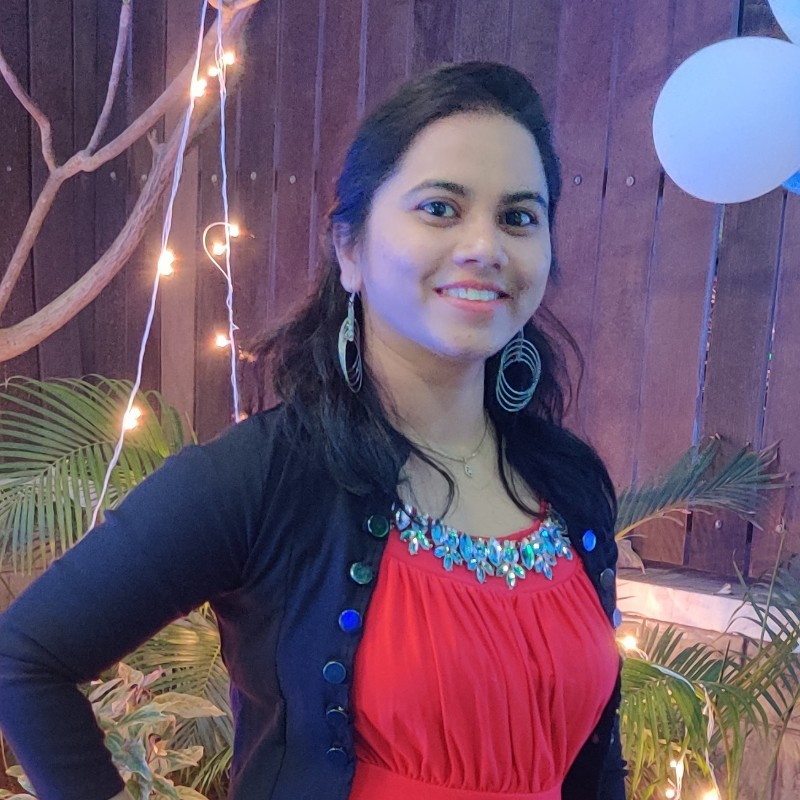

# Manisha Swargam

**Regulatory Compliance & Strategic Consulting Professional**

Welcome to my GitHub profile! I’m Manisha Swargam, a dedicated Regulatory Affairs Specialist with over 9 years of experience in food, beverages, and dietary supplement compliance. My expertise spans navigating Health Canada, CFIA, and USFDA regulations to ensure products meet rigorous industry standards and achieve timely market entry.

---

## About Me

I have built a strong career by combining deep regulatory knowledge with strategic consulting to help food brands and manufacturers optimize their compliance and quality assurance processes. I’m passionate about:
- Developing robust regulatory roadmaps.
- Designing compliant product labels and documentation.
- Collaborating with cross-functional teams to streamline processes.
- Continuous learning and applying best practices in regulatory affairs.

---

## Portfolio & Projects

I have developed an online portfolio showcasing my professional journey, key projects, and initiatives that demonstrate my ability to:
- Serve as the primary liaison with regulatory agencies.
- Oversee quality assurance and audit processes.
- Implement innovative labeling and compliance solutions.

Visit my live portfolio here: [Manisha Swargam Portfolio](https://yourusername.github.io/manisha-portfolio/)

---

## Core Competencies

- **Regulatory Compliance:** Health Canada, CFIA, USFDA
- **Product Labeling & Claims Review:** Nutritional, allergen, and ingredient declarations
- **Pre-market Approval:** Strategic planning and dossier compilation for food and NHPs
- **Quality Assurance:** HACCP, GMP, and audit process management
- **Strategic Consulting:** Regulatory roadmap development and partnership building
- **Technical Expertise:** InDesign, regulatory database management, and quality assurance tools

---

## Certifications

- **HACCP Manager Certificate Course**
- **Nutrition Labelling Online Certificate** – Public Health Agency of Canada (Certificate #35533)

---

## Get In Touch

I’m always open to discussing regulatory strategies, industry trends, or potential collaborations. You can reach me at:

- **Email:** [manisha.jan10@gmail.com](mailto:manisha.jan10@gmail.com)
- **LinkedIn:** [Manisha Swargam](https://www.linkedin.com/in/manisha-swargam-ab206713a/)

Thank you for visiting my profile. Let's connect and make compliance and quality assurance an asset for your business!

---

*© 2025 Manisha Swargam. All Rights Reserved.*
